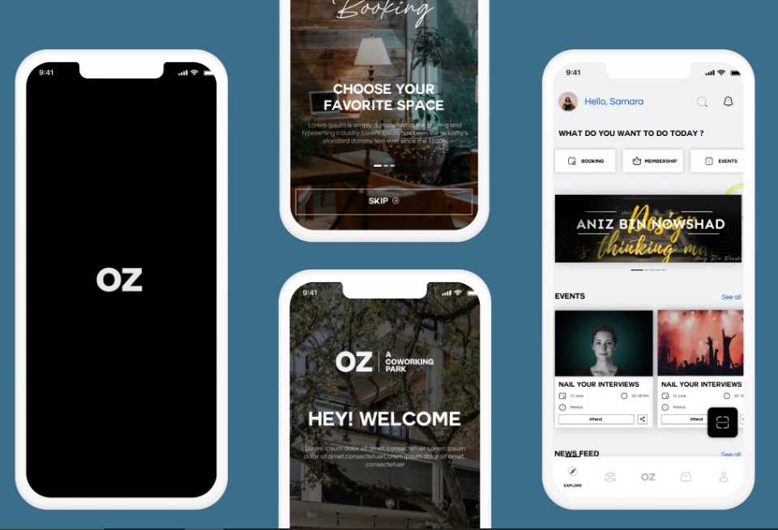

# OZ (Co-Working Park) App

This repository showcases the work done on the OZ (Co-Working Park) mobile application developed for Macber Egy company.

## Overview

OZ Innovations aims to revolutionize workplace concepts and enhance the future of work. The mobile app is designed to provide an optimal user experience with features like authentication, membership management, booking systems, events, notifications, profile management, and more.

## Features

1. **Authentication:**
   - Register and login as a guest or user
   - OTP-based registration

2. **Membership Management:**
   - Check and manage your membership
   - View progress and make payments

3. **Booking System:**
   - Book meeting rooms, auditoriums, gym, private offices, meta lab, etc.

4. **Events:**
   - View and book events organized by OZ

5. **Favorites:**
   - Favorite your bookings or events

6. **Notifications:**
   - View notifications

7. **Profile Management:**
   - View history, favorites, rewards
   - Report issues, contact admin
   - Profile management

8. **Additional Features:**
   - OZ Knowledge for sharing knowledge
   - In-app payments for services

## Technologies Used

- **State Management:** [Flutter Bloc](https://pub.dev/packages/flutter_bloc)
- **Authentication:** [Firebase Auth](https://pub.dev/packages/firebase_auth)
- **Networking:** [HTTP](https://pub.dev/packages/http)
- **Notifications:** [Firebase Messaging](https://pub.dev/packages/firebase_messaging), [Flutter Local Notifications](https://pub.dev/packages/flutter_local_notifications)
- **Storage:** [Path Provider](https://pub.dev/packages/path_provider), [Shared Preferences](https://pub.dev/packages/shared_preferences), [Flutter Secure Storage](https://pub.dev/packages/flutter_secure_storage)
- **Other:** [URL Launcher](https://pub.dev/packages/url_launcher), [Video Player](https://pub.dev/packages/video_player), [QR Code Scanner](https://pub.dev/packages/qr_code_scanner)

## Installation

The app will be available on the Play Store and App Store soon for review.

## Contribution

I contributed to this project as a Co-Developer. The project is owned by Macber Egy and will be launched on the Play Store and App Store soon.

## Links

- [OZ Website](https://)
- [Macber Egy Website](https://macber.co/our-work/1)
- [OZ Workspace LinkedIn Page](https://www.linkedin.com/company/oz-a-coworking-park/posts/?feedView=all)
